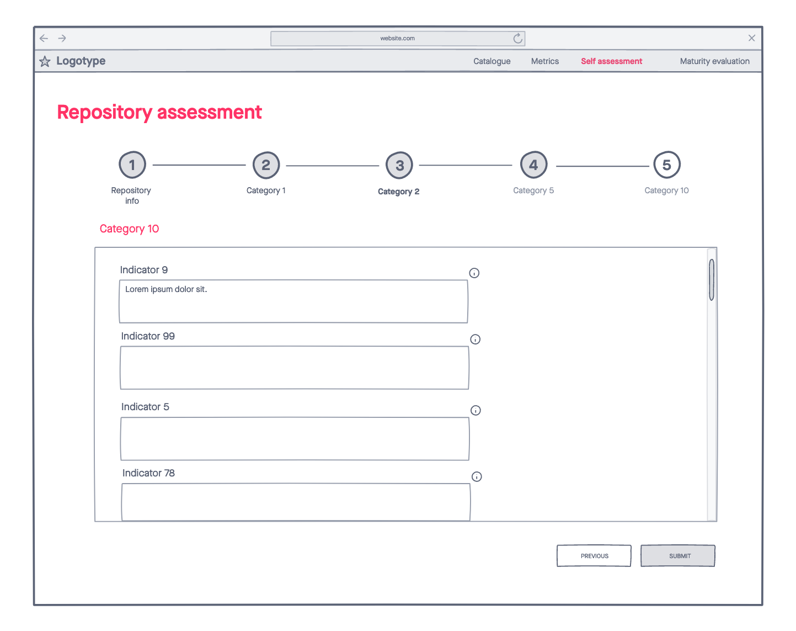
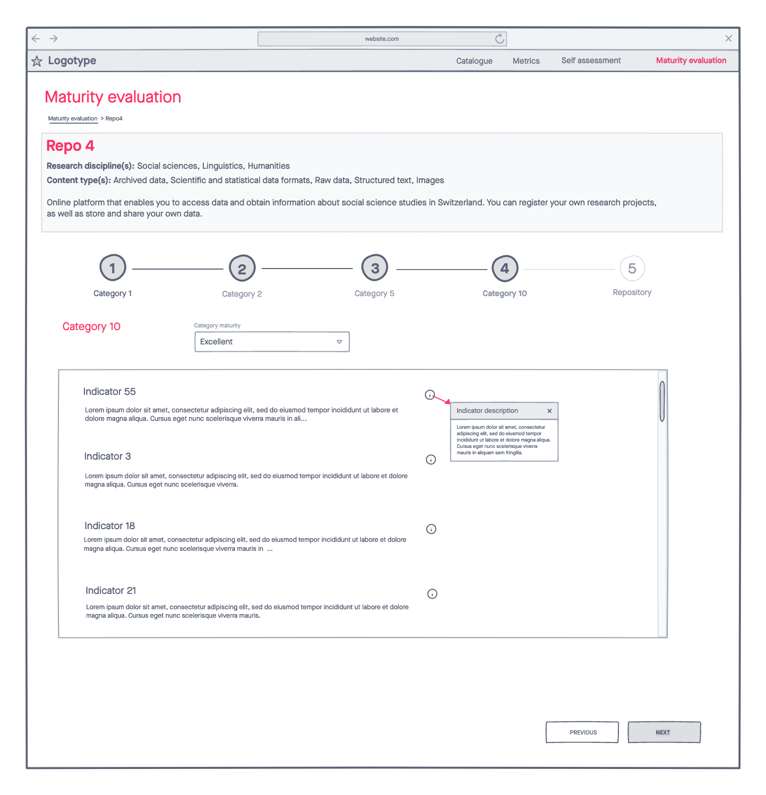

<!---
This file is part of swiss repositories.

It is the documentation of a prototype which has several aims:
1) to help researchers to find the best repository for their needs,
2) to receive feedback from researchers what are the most important
points for deciding for or against a repository,
3) to help repositories to see where they stand in comparison to
other repositories and where they should put efforts in,
4) to make the process of evaluation of repositories more transparent 
for researchers, evaluators and repositories.

This prototype was developed during the Open Research Data 
Hackathon 2021 based on preliminary work accomplished by Bojana Tasic
from FORS who suggested this topic to hack on and who made the results 
of preparatory work available. The 
Members of the working group were Bojana Tasic and Guillaume Lefebvre from 
FORS, as well as Rita Gautschy and Daniela Subotic from the Data and Service 
Center for the Humanities (DaSCH).
-->

# Objective
Imagine researchers who need to deposit their data. Imagine repositories that want to know where they stand in comparison to other repositories. Imagine repositories that intend to receive feedback from researchers about their priorities when choosing a certain repository. Imagine an evaluation process of repositories with an assigned maturity level at the end of the process which is transparent for researchers, repositories and evaluating experts.

**swiss repositories** is a tool that provides the stakeholders with what they are looking for:
1. Researchers with a list of widely used, high-quality, and well-documented repositories that have been evaluated by experts according to well defined criteria within different categories.
2. Repositories with feedback on their performance in different categories, which allows them to identify where they should put efforts to improve their performance
3. Evaluating experts with an established workflow for their evaluation process.

# Workflow
Figure 1 illustrates the overall workflow of **swiss repositories**. 

Figure 1: Workflow of swiss repositories.

## Step 1
Starting on the left there is a community of various stakeholders - researchers, repositories and experts with different backgrounds who have varying ideas about what are the most important criteria a suitable repository should fulfill. While for a data scientist questions concerning data protection measures and sustainability may prevail, researchers on the other hand may have completely different concerns such as where their peers deposit their data or whether a user-friendly interface exists. Thus, it is vital that all these stakeholders are taken into account when the criteria for the evaluation of repositories are defined. Repositories need to fulfill on one hand the demands of data scientists, but on the other hand also the demands of researchers. In accordance with the latest publications of the European Open Science Cloud ([EOSC](https://www.eosc-portal.eu/about/eosc)) we will denote the criteria or assessment questions of maturity by the term **indicators** in the following.

## Step 2
Based on the proposition of stakeholders a list of indicators of maturity is compiled. The indicators should be reviewed and updated at regular intervals.

## Step 3
A group of experts selects indicators from the list, assigns the weight to individual indicators, defines further ones if deemed necessary and assigns the selected indicators to different categories. The final result of this step is the definition of the **metric** - a list of indicators that allows to measure the maturity of a repository.

Several points are worth mentioning here:
1. The group of experts has to consist of people with different scientific backgrounds.
2. The metric should be division or discipline specific. Since most repositories have a focus on certain research fields - e.g. Social Sciences, Humanities, Life Sciences - it would not make sense to evaluate all of them based on the same metric. Aspects such as the anonymisation of data which are very important in Social Sciences are irrelevant for other research fields. The assessment process has to account for such domain specific differences. 
3. The metric should be reviewed and updated at regular intervals according to the input of stakeholders and new technical developments as well as international initiatives.

## Step 4
In the following step of the workflow repositories do a self-assessment based on the metric, i.e. they answer the questions which were selected as being representative to assess the maturity level of a repository by experts.  

## Step 5
Based on the answers of the repositories and their own assessment experts evaluate repositories. Evaluation is done per category and per research field for each repository. The overall assigned maturity level of a repository is the mean of the single categories. 

## Step 6
The results of the evaluation process will be published in a catalogue of repositories where the repositories are listed per research field with their assigned maturity levels. This catalogue can be browsed by stakeholders. 

# Prototype
During the Open Research Data Hackathon 2021 a prototype of **swiss repositories** was developed based on preliminary work accomplished by the SWISSUbase project. A list of indicators and categories was available at the beginning of the Hackathon. Indicators and categories were reviewed and a data model established. For the prototype a total of 75 indicators has been distributed into the following 10 categories:
1. Data protection measures
2. Findability
3. Accessability
4. Interoperability
5. Reusability
6. Preservation
7. Sustainability
8. Services
9. Compliance
10. Researcher's issues 

Currently, there is only one metric and a tailored process according to research field thus not taken into account.

Figure 2 illustrates the implemented data model.

Figure 2: Data model of swiss repositories.

For this prototype we played the role of the experts and made assessments ourselves for the two use-cases SWISSUbase and zenodo. It has to be stressed that the result is not representative - we lacked the self-assessment information of zenodo.

Currently four different levels of maturity are implemented:
- 1 - inadequate
- 2 - basic
- 3 - adequate
- 4 - excellent 
 

## Mockups
Our prototype has four different areas. The one displaying the results to the community is the catalogue area. It contains a list of repositories with their name, disciplines, their content type, a bit of general information and finally their assigned maturity level. From there three more areas are accessible via tabs which are concerned with the workflow behind the organisation of the whole process.

Figure 3: Mockup of the catalogue area.

When clicking on the *Metrics* tab the user accesses the metrics area. This is the place to add, edit and delete categories. 

Figure 4: Mockup of categories in the metrics area.

Once the categories for a certain metric are established, one can switch to the indicators tab and add, edit and delete indicators as well as determine their weight. Furthermore, the type of the answer can be defined. 

Figure 5: Mockup of the indicators in the metrics area.

The following Figure 5 shows the details for one specific metric. On the left the categories of the metric are listed while on the right the indicators which belong to the selected category are displayed.

Figure 6: Mockup of categories of one specific metric.

When clicking on the *Self assessment* tab repositories access the area where they can answer the questions. They first have to fill in general information about the repository (Figure 7).

Figure 7: Mockup of the main screen of the self-assessment area.

Depending on the provided information about research disciplines an appropriate metric for the repository will be determined. Repositories then can provide information for the single indicators of different categories and finally submit the form.  

Figure 8: Mockup of the self-assessment area.

The tab *Maturity evaluation* guides to the maturity evaluation area. This is the place where experts evaluate the maturity of the repositories per category. The entry page of this area displays a list of repositories which have provided their self-assessment already.

Figure 9: Mockup of the maturity evaluation area.

By choosing one of the repositories, the provided information can be accessed per category and evaluated by the expert.

Figure 10: Mockup of the display of information of one repository in the maturity evaluation area.

Each category is evaluated separately.

Figure 11: Mockup of evaluation process in the maturity evaluation area.

Finally, the results of the evaluation process are displayed per category. 

Figure 12: Mockup of display of the results of the maturity evaluation process.

## Appearance of the prototype
At the end of the hackathon the prototype had implemented functionalities of the *Catalogue* area and the *Metrics* area. All material can be found on branch **swiss-repositories** of the Swiss Open Research Data Hackathon 2021 on [GitHub](https://github.com/ORD-Hackathon/hackathon-2021/tree/swiss-repositories).

# Important aspects for further development
For further development a few aspects have to be taken into account. The need for the use of domain-specific metrics has already been elaborated on in this document. Weighting of individual indicators should also be implemented in order to improve the quality of repositories. Another important aspect is that the tool should be compliant with the following recently published recommendations of the European Open Science Cloud ([EOSC](https://www.eosc-portal.eu/about/eosc)):
- Recommendations on certifying services required to enable FAIR within EOSC (https://doi.org/10.2777/127253)
- Recommendations on FAIR metrics for EOSC Data service professionals (https://doi.org/10.2777/70791)

## Summary of the most important EOSC results
The **TRUST principles** are of particular importance for both EOSC and Open Science. The TRUST principles stand for **T**ransparency, **R**esponsibility, **U**ser Focus, **S**ustainability and **T**echnology. These principles run like a thread through the following aspects for further development. The **USA Office of Science and Technology Policy** stated eleven characteristics for all of the data repositories which include among others free and easy access to data, reuse, curation and quality assurance. This lines up with the aim of this prototype. 

The expert group **Turning FAIR into Reality** has pointed to particular importance of incentivization and support. The repositories must benefit from the self-assessment and they must also receive the necessary support to guide them through the process. To gain further insight here, repositories should be asked about the motivations for such self-assessment. In addition, differences in the disciplines should already be elicited here, since the metrics are to be created domain-specifically. 

Different working groups on the FAIR Principles exist already. Through the recommendations of **Turning FAIR into reality** - to create an aggregation between the existing activities of the working groups - the **RDA FAIR Data Maturity Model Working Group** was established. It consisted of international experts. The RDA FAIR Data Maturity Model Working group prioritized the indicators and their main finding is that interoperability is not yet as progressed as the EOSC would like. International cooperation is of central importance to the EOSC. If the indicators in the prototype are compliant to the EOSC Indicators, this could be another incentive for a repository to undergo the self-assessment. The **EOSC Strategic Research and Innovation Agenda (SRIA)** specifically emphasizes that a certification process such as the metric should not be used to make repositories comparable. Care should be taken here to ensure that repositories that are not yet widely certified do not suffer a significant disadvantage.

A further effort in the FAIR principles is the focus on research software, which has led to another working group in 2020 (**FAIR4RS**). The newly formed working group aims to revise and extend the FAIR principles specifically for research software. Therefore, in the further development of the prototype, more attention should be paid to interoperability of a repository.